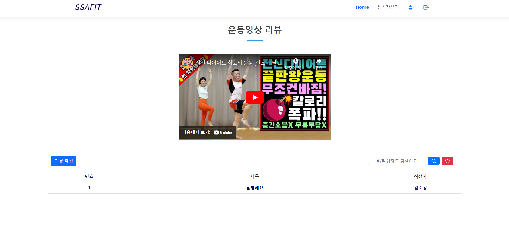

# Frontend 프로젝트

---

## 💪프로젝트 목표

---

- 과정에서 배운 Web Front 기술인 HTML / CSS / Javascript를 이해하고 활용할 수
있다.
- CSS, Bootstrap을 활용해서 향상된 디자인을 구현할 수 있다.
- Ajax를 활용해서 사이트를 구축할 수 있다.
- UX(사용자 경험), UI(사용자 인터페이스)를 고려한 사이트를 구현하여 사용자
입장에서 편리하고 멋진 디자인을 설계해 본다

---

---

## 💻 요구 사항

1. Wireframe Tool을 이용하여 구현할 웹 페이지 프로토타입을 설계해 본다.
2. 웹페이지 구현시 VSCode를 이용하여 구현한다.

---

### ⁉️ 기본 기능

---

- 다양한 운동영상정보와 영상의 리뷰와 관련된 페이지를 제공한다.
- 메인페이지 구성
: 운동영상 정보의 다양한 화면 구성(최근 인기 영상, 운동 부위별 영상 등)
: 메인페이지의 영상화면은 제공된 Ajax를 이용(json 데이터 파일 로딩)
- 메뉴 구성 : 사이트의 주요 메뉴를 구성
- 운동영상에 대한 리뷰 관리 페이지 구성
: 목록, 등록, 수정, 상세, 삭제

---

### ⁉️ 추가 기능

---

- 사이트의 다양한 기능을 사용하기 위해서 회원가입, 로그인 페이지를 제공한다.
    - 회원가입 페이지
    - 로그인 페이지

---

### ⁉️ 심화 기능

---

- 심화 기능
관심있는 영상에 대한 찜 관리 페이지와 회원간 팔로우 페이지를 제공한다.
회원은 다른 회원을 팔로우 할 수 있다.
    - 회원간 팔로우 관리 페이지
    - 회원의 운동영상 찜 관리 페이지

---

---

## ‼️기능 구현 화면 & 상세 설명

---

### ❗시작화면

---

- 헤더와 히어로 이미지, 본문(검색창, 인기 영상, 부위별 영상) 그리고 푸터로 구성

- 인기 영상의 경우, 멀티 슬라이드 형식으로 버튼을 클릭하여 슬라이드를 넘기는 형식으로 구성

content.com/109265165/188420856-2

---

### ❗로그인 화면

---

- 빈칸으로 두고 로그인을 할 시 정보를 작성하라는 경고창을 띄움

- 없는 정보로 로그인을 시도한다면 아이디가 없거나 비밀번호가 틀렸다고 경고창을 띄움

---

### ❗회원가입 화면

---

- 회원가입 창과 로컬스토리지

- 회원가입 성공시 정보가 로컬스토리지에 저장이 되고 로그인 화면으로 전환

---

### ❗성공적인 로그인 후 화면

---

- 회원가입 후 로그인 성공시 환영한다는 창과 함께 메인 화면으로 넘어감

---

### ❗영상과 관련 리뷰 화면

---

- 해당 영상을 재생할 수 있으며, 리뷰를 볼수 있음

- 해당 영상에 대한 찜을 할 수있음

---

### ❗리뷰 작성 화면

---

- 리뷰를 작성하고 등록하면 영상 밑에 추가가 되며, 로컬스토리지에도 저장이 됨

---

### ❗리뷰 상세 화면 & 수정 화면

---

---

## ✌️프로젝트를 하고 난 느낀점

---
    
- **박수민**
    
    웹페이지 하나를 만드는데 이렇게 오랜 시간이 걸릴 줄은 생각도 못했습니다. 그만큼 아직 언어를 사용하는데 익숙하지 않았다는 것 같아 더 노력해야겠다는 생각이 들었습니다. 자바스크립을 이용하여 로컬스토리지에 저장하는 방법까지는 구현했지만 리뷰 수정까지는 하지 못하였는데 좀 더 공부하여 지금보다 더욱 완벽한 웹페이지를 구현하고 싶다는 생각을 하였습니다. 
    
    자바 때와는 다르게 고민하는 시간이 더 많았는데 그만큼 부족하다는 것을 받아들이고 더 열심히 해야겠다는 다짐을 할 수 있었던 시간이었습니다.
